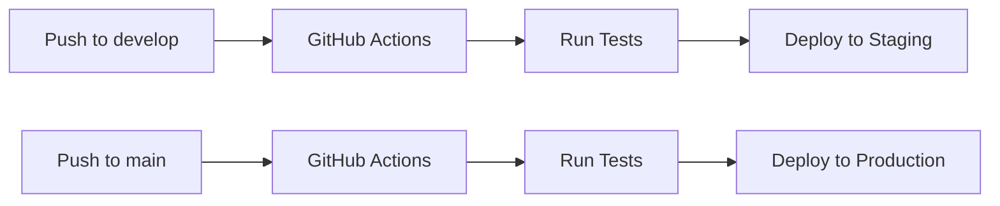
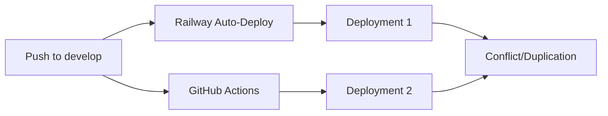

# Railway Deployment Management

## 🚨 Common Frontend Deployment Issues

### Issue 1: Frontend Directory Context Problem

**Problem**: Railway deployments fail because GitHub Actions runs `railway up` from the wrong directory.

**Symptoms**:
- Frontend builds succeed locally
- GitHub Actions deployments fail with "Could not find root directory: frontend"
- Manual Railway deployments work from frontend directory

**Root Cause**: In GitHub Actions, `cd frontend` and `railway up` run in separate shell contexts.

**Fix Applied**:
```yaml
# ❌ WRONG - separate commands
cd frontend
railway up --detach --environment staging --service Frontend

# ✅ CORRECT - single command
cd frontend && railway up --detach --environment staging --service Frontend
```

### Issue 2: Duplicate Deployment Issue

**Problem**: Both Railway's auto-deploy and GitHub Actions are triggering deployments, causing duplicate deployments and potential conflicts.

## 🔧 Solution: Choose One Deployment Method

### Option 1: GitHub Actions Only (Recommended)

**Benefits:**
- Full control over deployment process
- Integrated with testing and validation
- Environment-specific configurations
- Audit trail in GitHub

**Steps to Implement:**

1. **Disable Railway Auto-Deploy:**
   ```bash
   # Check current Railway settings
   ./scripts/deployment/check-duplicate-deployments.sh
   
   # Open Railway dashboard
   railway open
   ```

2. **In Railway Dashboard:**
   - Go to each project (carparts-staging, carparts-production)
   - For each service (Backend, Frontend):
     - Settings → Source
     - Disconnect GitHub or disable "Auto Deploy"

3. **Keep GitHub Actions:**
   - The current `.github/workflows/railway-deploy.yml` will be the only deployment method
   - Deployments trigger on:
     - `develop` branch → Staging
     - `main` branch → Production

### Option 2: Railway Auto-Deploy Only

**Benefits:**
- Simpler setup
- Direct Railway integration
- Faster deployments

**Steps to Implement:**

1. **Disable GitHub Actions Railway Commands:**
   ```bash
   # Edit the workflow file
   nano .github/workflows/railway-deploy.yml
   ```

2. **Comment out deployment commands:**
   ```yaml
   # - name: Deploy Backend to Staging
   #   run: railway up --detach --environment staging --service backend
   
   # - name: Deploy Frontend to Staging  
   #   run: railway up --detach --environment staging --service frontend
   ```

3. **Keep only testing steps in GitHub Actions**

## 🛠️ Current Configuration Status

Run this to check your current setup:

```bash
./scripts/deployment/check-duplicate-deployments.sh
```

## 🎯 Recommended Setup (GitHub Actions Only)



## 🚫 Current Problematic Setup



## 📋 Quick Fix Commands

1. **Check current status:**
   ```bash
   railway status
   ./scripts/deployment/check-duplicate-deployments.sh
   ```

2. **Open Railway dashboard:**
   ```bash
   railway open
   ```

3. **View recent deployments:**
   ```bash
   railway logs --deployment
   ```

4. **Test deployment manually:**
   ```bash
   # From frontend directory
   cd frontend
   railway up --detach --environment staging --service frontend
   
   # From root directory  
   railway up --detach --environment staging --service backend
   ```

## 🔄 Migration Steps

If you choose **GitHub Actions Only** (recommended):

1. ✅ **First: Ensure GitHub Actions work properly**
2. ✅ **Then: Disable Railway auto-deploy**
3. ✅ **Test: Push to develop branch and verify single deployment**

## 📊 Monitoring

After implementing the fix:

- Monitor GitHub Actions logs for successful deployments
- Check Railway dashboard for single deployments per push
- Verify application functionality after deployments

## 🆘 Troubleshooting

If you still see duplicate deployments:

1. Check Railway service settings for each environment
2. Verify GitHub Actions workflow is using correct tokens
3. Ensure no other webhook integrations are enabled
4. Check for any manual deployments running simultaneously

## 📚 Related Documentation

- [GitHub Actions Workflow](.github/workflows/railway-deploy.yml)
- [Database Safety Scripts](../database/README.md) 
- [Railway Configuration Files](../../railway.json)
-

